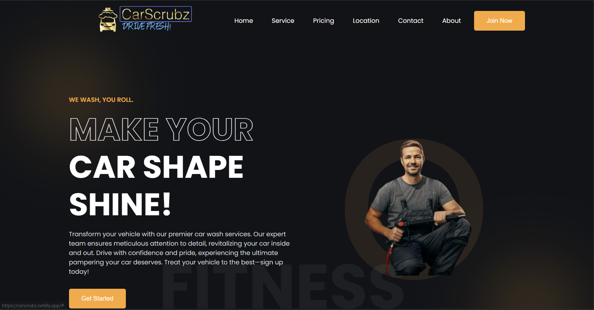

# 🚘 CarScrubz — Premium Car Wash Service Website  

<div align="center">
  
  <br><br>

  <h1 style="font-weight: 800; margin-bottom: 0;">
    CarScrubz | Professional Car Washing & Detailing Platform
  </h1>

  <p style="color: #666; font-size: 1.1rem; max-width: 650px;">
    A clean, premium, and fully responsive car washing service website 
    engineered using pure HTML5 and CSS3.
    Built with a focus on semantic structure, modern UI design, and 
    production-level layout architecture — without using any frameworks or JavaScript.
  </p>

  <br>

  <a href="https://carscrubz.netlify.app">
    
  </a>

  <br><br>

  
  
  
  

</div>

---

# 📌 Project Overview

**CarScrubz** is a premium car washing and detailing service website designed to replicate a real-world service-based business platform.

This project demonstrates:

- Strong HTML semantic structuring
- Modern CSS layout engineering
- Clean UI composition
- Responsive design implementation
- Zero-framework frontend architecture
- Professional landing page presentation

The entire system is built using **only HTML and CSS**, proving mastery of core web fundamentals.

---

# 🎯 Purpose of the Project

This project was built to:

- Showcase premium service packages
- Present business offerings clearly
- Improve visual trust & brand positioning
- Demonstrate frontend layout architecture skills
- Prove strong understanding of CSS design systems

No libraries.  
No frameworks.  
No JavaScript.  
Pure frontend fundamentals.

---

# 🛠️ Technology Stack

| Layer | Technology | Implementation Details |
|-------|------------|------------------------|
| **Markup** | HTML5 | Semantic elements (`section`, `nav`, `header`, `footer`) |
| **Styling** | CSS3 | Flexbox, CSS Grid, Variables, Media Queries |
| **Layout System** | Modern CSS | Structured container system, alignment utilities |
| **Deployment** | Netlify | Static production deployment |

---

# ✨ Core Features

✔ Fully Responsive (Mobile / Tablet / Desktop)  
✔ Premium Modern UI  
✔ Structured Service Sections  
✔ Clean Navigation Layout  
✔ Optimized Image Positioning  
✔ Lightweight Static Website  
✔ Zero JavaScript Implementation  
✔ Framework-Free Architecture  

---

# 🎨 Design Highlights

- Consistent spacing system
- Clean typography hierarchy
- Modern card-based layout
- Structured grid alignment
- Business-oriented color palette
- Visual hierarchy for service packages

Designed to simulate a real-world premium service brand.

---

# 📸 Interface Gallery

<div align="center">
  
  
</div>

<br>

<div align="center">
  
  <br><br>
  
</div>

---

# 📂 Project Structure

```
Carscrubz-Website/
│
├── CarScrubz/
│   ├── assets/
│   │   ├── logo.png
│   │   ├── class-1.jpg
│   │   ├── class-2.jpg
│   │   ├── Home_Page.png
│   │   ├── join.jpg
│   │
│   ├── index.html
│   ├── style.css
│
├── README.md
```

Structured for clarity and maintainability.

---

# ⚡ Performance Advantages

Since this is a static HTML + CSS website:

- Extremely fast load time
- Minimal resource usage
- No script execution overhead
- SEO-friendly semantic structure
- Lightweight production deployment

---

# 🔮 Future Enhancement Possibilities

This project can be extended with:

- Online booking system
- Payment gateway integration
- Service scheduling dashboard
- Admin management panel
- Customer authentication
- Backend API integration

Architecture is prepared for scalability.

---

# 🧪 Local Setup

```bash
git clone https://github.com/arvindvadivelu/Carscrubz-Website.git

cd Carscrubz-Website
```

Open `index.html` in your browser  
(or use Live Server in VS Code)

---

# 👨‍💻 Author

**Arvind V**  
Frontend Developer | UI Layout Engineer  

Focused on building clean, scalable, production-grade frontend systems using strong core fundamentals.

---

# 📄 License

This project is licensed under the MIT License.

---

# ⭐ Support

If you found this project useful, consider giving it a ⭐ on GitHub.
